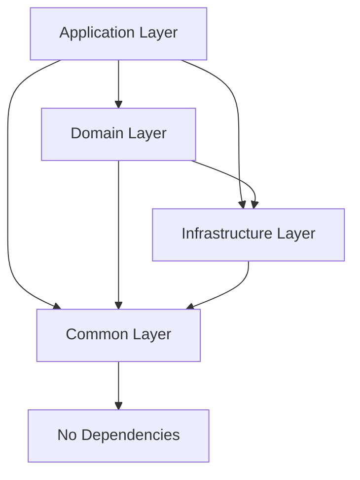

# AuriMyth Foundation Kit 架构文档

AuriMyth Foundation Kit 是一个基于 Python 的企业级微服务开发框架，旨在提供标准化、可扩展且易于维护的基础设施。它采用**分层架构**，严格遵循关注点分离和单向依赖原则。

## 1. 核心架构概览

项目采用经典的四层架构设计：



### 1.1 目录结构

```
aurimyth/foundation_kit/
├── application/      # 应用层：程序入口、配置、中间件、RPC
├── domain/           # 领域层：业务模型、仓储接口、服务基类
├── infrastructure/   # 基础设施层：数据库、缓存、消息队列的具体实现
├── common/           # 基础层：通用异常、日志、工具类
└── toolkit/          # 工具箱：独立的 HTTP 客户端等工具
```

---

## 2. 层次详解

### 2.1 Application Layer (应用层)
**职责**：负责应用的组装、配置加载、中间件处理以及对外的接口暴露。它是系统的入口。

*   **FoundationApp & Components**: 框架的核心引擎。`FoundationApp` 继承自 FastAPI，引入了 `Component` 概念。
    *   **生命周期管理**: 所有功能模块（数据库、缓存等）都封装为 `Component`。
    *   **拓扑排序**: 自动解析组件间的 `depends_on` 关系，确保按正确顺序启动和关闭。
*   **Configuration**: 基于 `pydantic-settings` 的分层配置系统 (`BaseConfig`)，作为基础设施层配置的适配器。
*   **RPC Client**: 提供服务发现能力的 HTTP RPC 客户端。
*   **Middleware**: 全局中间件，如 `RequestLoggingMiddleware`。

### 2.2 Domain Layer (领域层)
**职责**：包含核心业务逻辑、数据模型定义和持久化接口。

*   **Models**: 基于 SQLAlchemy 2.0 的声明式模型基类 `Base`，支持跨数据库的 `GUID` 类型。
*   **Repository Interface**: 定义了 `IRepository[ModelType]` 接口，规范了 CRUD 操作。
*   **Repository Implementation**: 提供了 `BaseRepository` 的通用实现，包含：
    *   标准 CRUD (Create, Read, Update, Delete)
    *   分页 (`paginate`) 与 排序
    *   软删除 (`soft delete`) 支持
    *   批量操作 (`bulk_insert`, `bulk_update`)
*   **Services**: 业务逻辑的基类。

### 2.3 Infrastructure Layer (基础设施层)
**职责**：提供技术细节的具体实现。**严禁包含业务逻辑**。这一层大量使用**单例管理器模式 (Singleton Manager Pattern)**。

*   **Database**: `DatabaseManager` 管理 SQLAlchemy 的 `AsyncEngine` 和连接池，提供会话工厂和健康检查。
*   **Cache**: `CacheManager` 提供统一接口，支持 Redis, Memory, Memcached 后端。
*   **Events**: `EventBus` 提供事件发布/订阅能力。
    *   **Local Mode**: 内存中的观察者模式。
    *   **Distributed Mode**: 基于 Kombu 的消息队列集成（Redis/RabbitMQ）。
*   **Tasks**: `TaskManager` 封装了 `dramatiq`。
    *   **Conditional Task**: 支持 Worker 模式（注册 Actor）和 API 模式（仅作为 Producer 发送消息）的自动切换。
*   **Dependency Injection**: `Container` 提供轻量级依赖注入，支持 Singleton, Scoped, Transient 生命周期。

### 2.4 Common Layer (基础层)
**职责**：提供跨层通用的工具和定义，**不依赖其他任何层**。

*   **Exceptions**: `FoundationError` 是所有异常的根类，支持元数据 (`metadata`) 和异常链。
*   **Logging**: 统一的日志配置和工具。

---

## 3. 关键设计模式

### 3.1 组件系统 (The Component System)

为了解耦框架的各个部分，AuriMyth 引入了组件系统。

```python
class Component(ABC):
    name: str
    depends_on: list[str]

    async def setup(self, app: FoundationApp, config: BaseConfig): ...
    async def teardown(self, app: FoundationApp): ...
```

开发者可以通过继承 `Component` 并将其添加到 `FoundationApp` 的组件列表中，轻松扩展应用功能。

### 3.2 双模任务队列 (Dual-Mode Task Queue)

为了解决微服务部署中 API 服务与 Worker 服务分离的问题，`TaskManager` 提供了智能的 `conditional_task`：

*   **Worker Mode**: 装饰器将函数注册为实际的 `dramatiq` actor，负责执行任务。
*   **API Mode**: 装饰器返回一个 `TaskProxy`，它不注册 actor（避免在 API 服务中加载不必要的任务代码），但保留 `send()` 接口用于发布任务。

### 3.3 仓储模式 (Repository Pattern)

框架通过泛型 `BaseRepository[ModelType]` 极大地简化了数据访问层代码。开发者只需继承基类，即可获得完整的增删改查能力，无需重复编写 SQL 或 ORM 样板代码。

### 3.4 依赖注入 (Dependency Injection)

内置的 `Container` 实现了 IoC (控制反转)。
*   支持自动解析构造函数类型提示。
*   `Scope` 机制确保在请求生命周期内的对象复用。

---

## 4. 部署视图

应用通常以两种角色部署：

1.  **API Server**: 处理 HTTP 请求，作为 RPC 服务端，作为任务生产者。
2.  **Worker**: 监听消息队列，作为任务消费者，处理后台作业和分布式事件。
